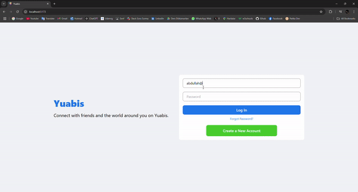

# DESCRIPTION

Bu proje bir sosyalmedya uygulamasıdır. bu projede post atabilir, resimli post atabilir ve arkadaşlarınızı takip edebilirsiniz. Gönderilerini beğenebilirsiniz. bu proje nodejs ve react kullanılarak oluşturulan bilgiler mongodb de tutulan bir full-stack projesidir.

`To run the Server: 'nodemon server.js'`

`To run the Client: type 'npm run dev'`

## FRONTEND TECHNOLOGIES

- axios, dotenv, react-router-dom, styled-components, timeago.js, material-icons, tailwind

## BACKEND TECHNOLOGIES

- nodejs, bcrypt, cors, dotenv, express, mongoose, multer, nodemon, path

## PROJECT GIF

